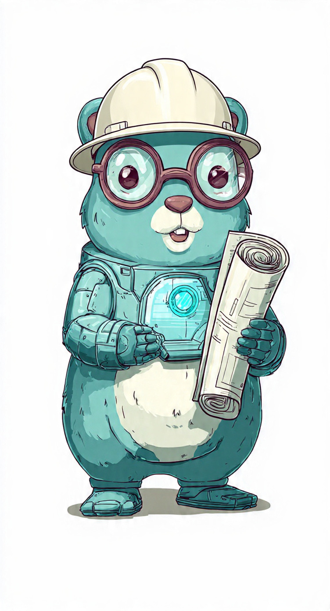

# ArchLang

[](https://go.dev)
[](https://opensource.org/licenses/MIT)
[](https://goreportcard.com/report/github.com/mcabezas/archlang)
[](https://github.com/mcabezas/archlang/actions/workflows/ci.yml)

**Architecture documentation that never lies.**

ArchLang is a programming language for defining solution architectures. It compiles `.arch` files into a typed, queryable knowledge graph — serving architecture facts to humans and AI agents through multiple protocols.

No more outdated wikis. No more tribal knowledge. No more diagrams that rot the day after they're drawn. If it compiles, it's true.

<p align="center">
  
</p>

## The Problem

Architecture knowledge lives in the worst possible places: Confluence pages nobody updates, Miro boards nobody checks, and the heads of engineers who leave.

When a new team member asks "what depends on the order service?", the answer is a 30-minute meeting. When an AI agent needs to make an implementation decision, it hallucinates one.

Your code has type safety. Your infrastructure has Terraform. **Your architecture solution knowledge has nothing.**

## Why Nothing Like This Exists Yet

Tools exist in the neighborhood. None of them solve the actual problem.

| | Compiles | Validates refs | Org boundaries | Feature tracing | Queryable API | AI-agent ready |
|---|---|---|---|---|---|---|
| **Structurizr / C4 DSL** | No | No | No | No | No | No |
| **Backstage / Port / Cortex** | No | No | No | No | Partial | No |
| **Mermaid / PlantUML** | No | No | No | No | No | No |
| **Confluence / Wikis** | No | No | No | No | No | No |
| **ArchLang** | **Yes** | **Yes** | **Yes** | **Yes** | **Yes** | **Yes** |

Every existing tool either generates static diagrams or maintains a manual catalog. None of them **compile**. None of them treat an undeclared dependency as an error. None of them enforce organizational boundaries. None of them let you trace a business feature across every service collaboration. And none of them were designed for a world where AI agents need structured, deterministic facts to make implementation decisions — not Confluence pages to hallucinate from.

ArchLang is what happens when you apply the same rigor we already use for code and infrastructure to the one thing that still lives on whiteboards: architecture.

## The Solution

ArchLang treats architecture like code:

- **Write it** — Human-readable `.arch` files define components, services, collaborations, features, flows, and steps
- **Compile it** — The compiler validates everything at build time. Undeclared references, cross-org visibility violations, and missing imports are compile errors — not runtime surprises
- **Query it** — The compiled graph is served through REST, gRPC, MCP, and Slack. Same question, same answer, every time
- **Trace it** — Features, flows, and steps are first-class citizens. Trace a business capability across every collaboration in your architecture

```
import orgs/acme

public service api-gateway
service order-service
service payment-service
public service notification-service

feature checkout: "Process order payments at checkout" {
  flow purchase "End-to-end purchase journey" {
    collaboration api-gateway -> order-service {
      description: "REST POST /orders"
      step: initiate
    }
    collaboration order-service -> payment-service {
      description: "REST POST /payments with order payload and idempotency key"
      step: pay
    }
  }
}

feature notifications: "Send transactional notifications" {
  collaboration order-service -> notification-service {
    description: "Publishes order events"
    cardinality: one to many by event_type
  }
  collaboration notification-service -> orgs/acme.email-provider {
    description: "SMTP relay"
  }
}
```

This compiles. Every reference is validated. Cross-org targets are checked for public visibility. Features, flows, and steps are traced across the entire graph.

## Key Concepts

**Components, Services & Infra** — Define what exists in your architecture.

**Organizations** — Inferred from `orgs/` folder structure. Components that receive cross-org calls must be `public`. Enforced at compile time.

**Collaborations** — Define how components communicate. Each collaboration can carry a feature, description, cardinality, flow, and step. Duplicate collaborations between the same pair are allowed — one per feature.

**Features** — Declared with a name and description. Can be standalone or wrap a block of collaborations. Trace a feature across the entire graph to see every service involved.

**Flows** — Group collaborations into named sequences (e.g. `flow purchase { ... }`). Each flow can have a description. Collaborations inside a flow block are automatically tagged.

**Steps** — Label a phase within a flow (e.g. `step: initiate`). Multiple collaborations can share the same step. Steps require a flow.

**Visibility** — `public` or `internal`. Only public components can receive calls from other organizations. A service doesn't need to be public to call external services — only the target must be public. The compiler rejects anything else.

## Syntax

### Collaborations

A collaboration can be plain or carry metadata:

```
# Plain — just an edge
collaboration api-gateway -> order-service

# With inline feature and description
collaboration order-service -> payment-service {
  feature checkout: "REST POST /payments"
  cardinality: one to many by tenant_id
}
```

### Feature Blocks

Wrap collaborations in a feature block — all collaborations inside inherit the feature automatically:

```
feature checkout: "Process order payments" {
  collaboration api-gateway -> order-service {
    description: "REST POST /orders"
  }
  collaboration order-service -> payment-service {
    description: "REST POST /payments"
    cardinality: 1:N by tenant_id
  }
}
```

Using inline `feature` inside a feature block is a compile error.

### Flow Blocks

Group collaborations into named flows with optional descriptions and steps:

```
feature checkout: "Process order payments" {
  flow purchase "End-to-end purchase journey" {
    collaboration api-gateway -> order-service {
      description: "REST POST /orders"
      step: initiate
    }
    collaboration order-service -> payment-service {
      description: "REST POST /payments"
      step: pay
    }
  }
}
```

Flow descriptions can be inline (`flow name "description" { ... }`) or block-level (`description: "..."` inside the block).

Steps are ordered automatically — the compiler infers `sort_order` from their position in the flow definition.

Flows can also be used standalone (outside a feature block) or inline inside a collaboration:

```
# Standalone flow block
flow purchase "End-to-end purchase journey" {
  collaboration a -> b {
    feature checkout
    step: initiate
  }
}

# Inline flow inside a collaboration
collaboration a -> b {
  feature checkout
  flow purchase
  step: initiate
}
```

Using inline `flow` inside a flow block is a compile error. Steps require a flow.

## How It Works

```
.arch files → ArchLang Compiler → Knowledge Graph → API → AI Agents → Teams
```

1. Teams write `.arch` files — the single source of truth
2. The compiler generates a typed Go graph with all validations enforced
3. The Architecture Documentation Service exposes the graph via HTTP, gRPC, MCP, and Slack
4. An AI agent consumes the knowledge and serves it to engineering teams

The graph is deterministic. No AI in the data path. No hallucinations. The agent answers from compiled facts.

## Install

```bash
go install github.com/mcabezas/archlang/cmd/archlang@latest
```

### From Source

```bash
git clone https://github.com/mcabezas/archlang.git
cd archlang
go install ./cmd/archlang
```

## Usage

### 1. Define your architecture

Create `.arch` files inside an `architecture/` directory. Organize by domain using folders:

```
architecture/
  orgs/
    myteam/
      services.arch
      checkout.arch
    payments/
      services.arch
```

### 2. Generate Go code

```bash
archlang generate ./architecture --out ./generated --package generated
```

This compiles your `.arch` files into a type-safe Go package with all validations enforced.

### 3. Serve it

Create a `main.go` that imports the generated code and starts the built-in HTTP server:

```go
package main

import (
	"log"
	"os"

	"your-module/generated"

	sdk "github.com/mcabezas/archlang/sdk"
)

func main() {
	svc := sdk.New(generated.AllGraphs, generated.AllDomainGraphs)

	addr := os.Getenv("ADDR")
	if addr == "" {
		addr = ":8080"
	}

	server := sdk.NewHTTPServer(svc, addr)
	if err := server.Start(); err != nil {
		log.Fatal(err)
	}
}
```

The server handles graceful shutdown on `SIGINT`/`SIGTERM` out of the box.

### 4. Browse

- **Architecture Overview** — `http://localhost:8080/diagram`
- **Feature Diagram** — `http://localhost:8080/diagram?feature=checkout`
- **Component API** — `http://localhost:8080/api/components/orgs/myteam.order-service`

Diagrams are rendered as interactive Mermaid charts with a dark theme. Feature diagrams include flow and step breakdowns with descriptions.

### Custom transports

The generated code is a standalone Go package. You can build your own transport layer on top of the SDK:

```go
svc := sdk.New(generated.AllGraphs, generated.AllDomainGraphs)

// Use the SDK directly
components, _ := svc.ListAll()
features, _ := svc.ListFeatures()
component, _ := svc.FindByName("order-service")
collabs, _ := svc.FindByFlow("purchase")
```

Wire it to gRPC, MCP, Slack, or any protocol you need.

## Agents

The [`agents/`](agents/) directory contains agent implementations that wrap the Architecture Knowledge Graph. They provide natural language interfaces while guaranteeing all answers come from the compiled architecture — not from guessing.

- **MCP Server** — Model Context Protocol for AI coding assistants
- **Slack Bot** — Architecture queries in Slack channels

## Contributing

ArchLang is under active development. Contributions are welcome — open an issue or pull request.

## License

Unless otherwise noted, the ArchLang source files are distributed under the MIT license found in the LICENSE file.
